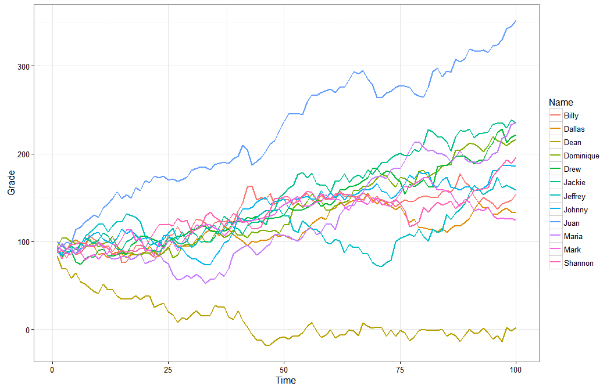
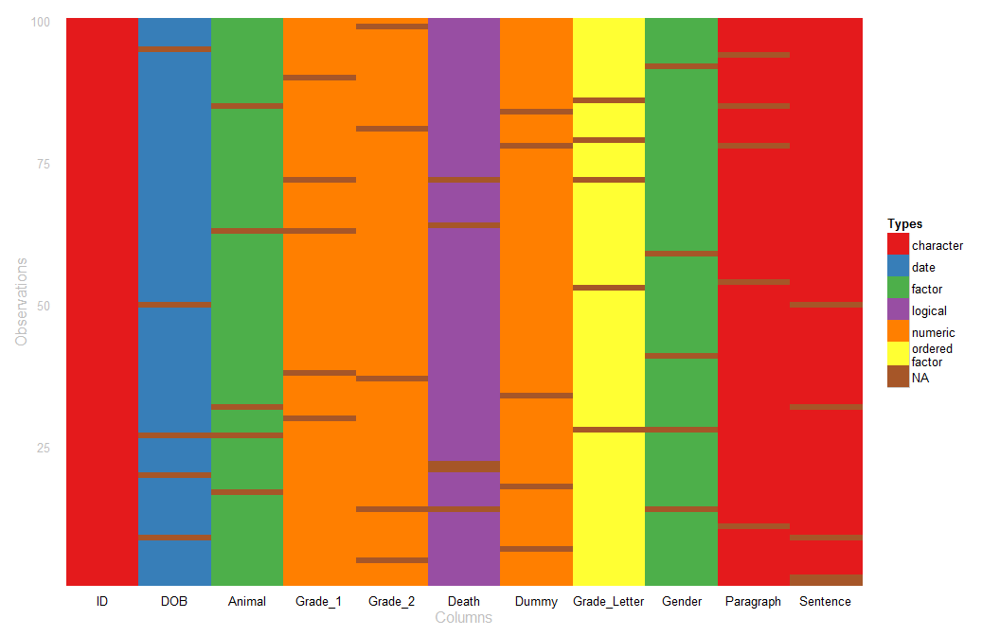

wakefield
============

**wakefield** is designed to quickly generate random data sets. The user
passes `n` (number of rows) and predefined vectors to the `r_data_frame`
function to produce a `dplyr::tbl_df` object.

Table of Contents
============

-   [Installation](#installation)
-   [Help](#help)
-   [Contact](#contact)
-   [Demonstration](#demonstration)
    -   [Getting Started](#getting-started)
    -   [Random Missing Observations](#random-missing-observations)
    -   [Repeated Measures & Time Series](#repeated-measures--time-series)
        -   [Related Series](#related-series)
            -   [Some Examples With Variation](#some-examples-with-variation)
            -   [Adjust Correlations](#adjust-correlations)
            -   [Visualize the Relationship](#visualize-the-relationship)
    -   [Expanded Dummy Coding](#expanded-dummy-coding)
    -   [Visualizing Column Types](#visualizing-column-types)

Installation
============

To download the development version of **wakefield**:

Download the [zip
ball](https://github.com/trinker/wakefield/zipball/master) or [tar
ball](https://github.com/trinker/wakefield/tarball/master), decompress
and run `R CMD INSTALL` on it, or use the **pacman** package to install
the development version:

    if (!require("pacman")) install.packages("pacman")
    pacman::p_load_gh("trinker/wakefield")
    pacman::p_load(dplyr, tidyr, ggplot2)

Help
====

-   [Package PDF Help
    Manual](https://dl.dropboxusercontent.com/u/61803503/wakefield.pdf)

Contact
=======

You are welcome to: 
* submit suggestions and bug-reports at: <https://github.com/trinker/wakefield/issues> 
* send a pull request on: <https://github.com/trinker/wakefield/> 
* compose a friendly e-mail to: <tyler.rinker@gmail.com>

Demonstration
=============

Getting Started
---------------

The `r_data_frame` function (random data frame) takes `n` (the number of
rows) and any number of variables (columns). These columns are typically
produced from a **wakefield** variable function. Each of these variable
functions has a pre-set behavior that produces a named vector of n
length, allowing the user to lazily pass unnamed functions (optionally,
without call parenthesis). The column name is hidden as a `varname`
attribute. For example here we see the `race` variable function:

    race(n=10)

    ##  [1] Black    White    White    White    White    Hispanic White   
    ##  [8] Asian    White    Hispanic
    ## Levels: White Hispanic Black Asian Bi-Racial Native Other Hawaiian

    attributes(race(n=10))

    ## $levels
    ## [1] "White"     "Hispanic"  "Black"     "Asian"     "Bi-Racial" "Native"   
    ## [7] "Other"     "Hawaiian" 
    ## 
    ## $class
    ## [1] "variable" "factor"  
    ## 
    ## $varname
    ## [1] "Race"

When this variable is used inside of `r_data_frame` the `varname` is
used as a column name. Additionally, the `n` argument is not set within
variable functions but is set once in `r_data_frame`:

    r_data_frame(
        n = 500,
        race
    )

    ## Source: local data frame [500 x 1]
    ## 
    ##        Race
    ## 1  Hispanic
    ## 2     White
    ## 3     White
    ## 4     White
    ## 5     Asian
    ## 6    Native
    ## 7     White
    ## 8     White
    ## 9     White
    ## 10   Native
    ## ..      ...

The power of `r_data_frame` is apparent when we use many modular
variable functions:

    r_data_frame(
        n = 500,
        id,
        race,
        age,
        sex,
        hour,
        iq,
        height,
        died
    )

    ## Source: local data frame [500 x 8]
    ## 
    ##     ID     Race Age    Sex     Hour  IQ Height  Died
    ## 1  001    White  22   Male 00:00:00 111     68  TRUE
    ## 2  002    White  35 Female 00:00:00 103     68  TRUE
    ## 3  003    White  33   Male 00:00:00 103     68  TRUE
    ## 4  004    White  31   Male 00:00:00  99     62  TRUE
    ## 5  005 Hispanic  20   Male 00:00:00 114     71  TRUE
    ## 6  006    White  21 Female 00:00:00 117     72  TRUE
    ## 7  007    White  26 Female 00:00:00  87     67 FALSE
    ## 8  008    White  30 Female 00:00:00 106     68 FALSE
    ## 9  009    White  22 Female 00:00:00  96     68 FALSE
    ## 10 010    White  24 Female 00:30:00  95     68  TRUE
    ## .. ...      ... ...    ...      ... ...    ...   ...

There are 68 **wakefield** based variable functions to chose from,
spanning **R**'s various data types (see `?variables` for details).

<!-- html table generated in R 3.2.0 by xtable 1.7-4 package -->
<!-- Sun May 03 15:06:00 2015 -->
<table>
<tr>
<td>
age
</td>
<td>
died
</td>
<td>
grade_level
</td>
<td>
likert_5
</td>
<td>
paragraph
</td>
<td>
speed_mph
</td>
</tr>
<tr>
<td>
animal
</td>
<td>
dna
</td>
<td>
group
</td>
<td>
likert_7
</td>
<td>
pet
</td>
<td>
state
</td>
</tr>
<tr>
<td>
answer
</td>
<td>
dob
</td>
<td>
hair
</td>
<td>
lorem_ipsum
</td>
<td>
political
</td>
<td>
string
</td>
</tr>
<tr>
<td>
area
</td>
<td>
dummy
</td>
<td>
height
</td>
<td>
lower
</td>
<td>
primary
</td>
<td>
upper
</td>
</tr>
<tr>
<td>
birth
</td>
<td>
education
</td>
<td>
height_cm
</td>
<td>
lower_factor
</td>
<td>
race
</td>
<td>
upper_factor
</td>
</tr>
<tr>
<td>
car
</td>
<td>
ela
</td>
<td>
height_in
</td>
<td>
marital
</td>
<td>
religion
</td>
<td>
valid
</td>
</tr>
<tr>
<td>
children
</td>
<td>
employment
</td>
<td>
income
</td>
<td>
math
</td>
<td>
sat
</td>
<td>
year
</td>
</tr>
<tr>
<td>
coin
</td>
<td>
eye
</td>
<td>
internet_browser
</td>
<td>
military
</td>
<td>
sentence
</td>
<td>
zip_code
</td>
</tr>
<tr>
<td>
color
</td>
<td>
gender
</td>
<td>
iq
</td>
<td>
month
</td>
<td>
sex
</td>
<td>
</td>
</tr>
<tr>
<td>
date_stamp
</td>
<td>
gpa
</td>
<td>
language
</td>
<td>
name
</td>
<td>
smokes
</td>
<td>
</td>
</tr>
<tr>
<td>
death
</td>
<td>
grade
</td>
<td>
level
</td>
<td>
normal
</td>
<td>
speed
</td>
<td>
</td>
</tr>
<tr>
<td>
dice
</td>
<td>
grade_letter
</td>
<td>
likert
</td>
<td>
normal_round
</td>
<td>
speed_kph
</td>
<td>
</td>
</tr>
</table>

<b><em>Available Variable Functions</em></b>

However, the user may also pass their own vector producing functions or
vectors to `r_data_frame`. Those with an `n` argument can be set by
`r_data_table`:

    r_data_frame(
        n = 500,
        id,
        Scoring = rnorm,
        Smoker = valid,
        race,
        age,
        sex,
        hour,
        iq,
        height,
        died
    )

    ## Source: local data frame [500 x 10]
    ## 
    ##     ID     Scoring Smoker     Race Age    Sex     Hour  IQ Height  Died
    ## 1  001 -1.55497269   TRUE    White  30 Female 00:00:00  99     64 FALSE
    ## 2  002  0.03764812  FALSE    White  26   Male 00:00:00  98     69 FALSE
    ## 3  003 -0.52439958   TRUE Hispanic  30 Female 00:00:00  81     73  TRUE
    ## 4  004  0.92652329   TRUE    White  34 Female 00:00:00  94     69  TRUE
    ## 5  005 -0.31391610   TRUE    White  26 Female 00:00:00 115     63 FALSE
    ## 6  006 -0.90419038  FALSE    White  30 Female 00:00:00  85     72  TRUE
    ## 7  007 -0.06114933  FALSE    White  20 Female 00:00:00 105     78 FALSE
    ## 8  008 -0.52231773   TRUE Hispanic  35   Male 00:00:00  85     71 FALSE
    ## 9  009 -0.11201893   TRUE    White  32   Male 00:00:00  87     72 FALSE
    ## 10 010  0.35581108   TRUE    White  29   Male 00:00:00  93     64 FALSE
    ## .. ...         ...    ...      ... ...    ...      ... ...    ...   ...

    r_data_frame(
        n = 500,
        id,
        age, age, age,
        grade, grade, grade
    )

    ## Source: local data frame [500 x 7]
    ## 
    ##     ID Age_1 Age_2 Age_3 Grade_1 Grade_2 Grade_3
    ## 1  001    21    28    29    81.0    89.0    91.7
    ## 2  002    34    21    29    95.5    87.7    77.9
    ## 3  003    22    26    28    82.3    97.2    87.9
    ## 4  004    23    33    30    86.5    85.0    90.9
    ## 5  005    22    23    29    90.0    89.5    94.1
    ## 6  006    35    27    24    85.1    85.4    90.3
    ## 7  007    30    24    20    93.4    93.9    85.3
    ## 8  008    20    34    25    84.2    86.3    83.5
    ## 9  009    27    23    31    86.3    86.2    85.9
    ## 10 010    29    22    29    89.4    92.0    88.5
    ## .. ...   ...   ...   ...     ...     ...     ...

While, passing variable functions to `r_data_frame` without call
parenthesis is handy the user may wish to set arguments. This can be
done through call parenthesis as we do with `data.frame` or
`dplyr::data_frame`:

    r_data_frame(
        n = 500,
        id,
        Scoring = rnorm,
        Smoker = valid,
        `Reading(mins)` = rpois(lambda=20),  
        race,
        age(x = 8:14),
        sex,
        hour,
        iq,
        height(mean=50, sd = 10),
        died
    )

    ## Source: local data frame [500 x 11]
    ## 
    ##     ID    Scoring Smoker Reading(mins)   Race Age    Sex     Hour  IQ
    ## 1  001 -0.7073903   TRUE            26  White  13 Female 00:00:00  98
    ## 2  002  1.4672761   TRUE            22  White   9   Male 00:00:00  96
    ## 3  003 -0.5170665   TRUE            13  White  14   Male 00:00:00 103
    ## 4  004  1.6018761  FALSE            18  White   9 Female 00:00:00  93
    ## 5  005 -1.2337803  FALSE            20  White   8   Male 00:00:00 122
    ## 6  006  1.5579188   TRUE            21  Black  13   Male 00:30:00  99
    ## 7  007  1.6368781   TRUE            19 Native   8 Female 00:30:00 102
    ## 8  008 -1.7516772   TRUE            15  White  11   Male 00:30:00  90
    ## 9  009  1.7511014   TRUE            16  Black  13   Male 00:30:00 113
    ## 10 010  2.1943126  FALSE            20  White  11 Female 00:30:00  89
    ## .. ...        ...    ...           ...    ... ...    ...      ... ...
    ## Variables not shown: Height (dbl), Died (lgl)

Random Missing Observations
---------------------------

Often data contains missing values. **wakefield** allows the user to add
a proportion of missing values per column/vector via the `r_na` (random
`NA`). This works nicely within a **dplyr**/**magrittr** `%>%` *then*
pipeline:

    r_data_frame(
        n = 30,
        id,
        race,
        age,
        sex,
        hour,
        iq,
        height,
        died,
        Scoring = rnorm,
        Smoker = valid
    ) %>%
        r_na(prob=.4)

    ## Source: local data frame [30 x 10]
    ## 
    ##    ID  Race Age    Sex     Hour  IQ Height  Died     Scoring Smoker
    ## 1  01    NA  NA   Male 00:30:00  90     70    NA -1.37469269  FALSE
    ## 2  02 White  NA     NA 01:00:00  98     66    NA  0.32233990     NA
    ## 3  03    NA  35 Female     <NA>  NA     70    NA  0.33168000   TRUE
    ## 4  04    NA  32   Male 04:00:00 120     NA FALSE          NA   TRUE
    ## 5  05 White  26   Male 05:30:00 109     72  TRUE          NA     NA
    ## 6  06 Black  NA Female     <NA>  NA     67    NA          NA   TRUE
    ## 7  07 White  26 Female 06:00:00  89     65 FALSE  0.18262883  FALSE
    ## 8  08 White  NA   Male     <NA>  NA     NA    NA -0.09481499   TRUE
    ## 9  09 White  24     NA 08:30:00  NA     71    NA          NA  FALSE
    ## 10 10    NA  22     NA 10:30:00 101     71  TRUE -2.57103417     NA
    ## .. ..   ... ...    ...      ... ...    ...   ...         ...    ...

Repeated Measures & Time Series
-------------------------------

The `r_series` function allows the user to pass a single **wakefield**
function and dictate how many columns (`j`) to produce.

    set.seed(10)

    r_series(likert, j = 3, n=10)

    ## Source: local data frame [10 x 3]
    ## 
    ##           Likert_1          Likert_2          Likert_3
    ## 1          Neutral          Disagree Strongly Disagree
    ## 2            Agree           Neutral          Disagree
    ## 3          Neutral   Strongly Agree           Disagree
    ## 4         Disagree           Neutral             Agree
    ## 5  Strongly Agree              Agree           Neutral
    ## 6            Agree           Neutral          Disagree
    ## 7            Agree   Strongly Agree  Strongly Disagree
    ## 8            Agree             Agree             Agree
    ## 9         Disagree             Agree          Disagree
    ## 10         Neutral Strongly Disagree             Agree

Often the user wants a numeric score for Likert type columns and similar
variables. For series with multiple factors the `as_integer` converts
all columns to integer values. Additionally, we may want to specify
column name prefixes. This can be accomplished via the variable
function's `name` argument. Both of these features are demonstrated
here.

    set.seed(10)

    as_integer(r_series(likert, j = 5, n=10, name = "Item"))

    ## Source: local data frame [10 x 5]
    ## 
    ##    Item_1 Item_2 Item_3 Item_4 Item_5
    ## 1       3      2      1      3      4
    ## 2       4      3      2      5      4
    ## 3       3      5      2      5      5
    ## 4       2      3      4      1      2
    ## 5       5      4      3      3      4
    ## 6       4      3      2      2      5
    ## 7       4      5      1      1      5
    ## 8       4      4      4      1      3
    ## 9       2      4      2      2      5
    ## 10      3      1      4      3      1

`r_series` can be used within a `r_data_frame` as well.

    set.seed(10)

    r_data_frame(n=100,
        id,
        age,
        sex,
        r_series(likert, 3, name = "Question")
    )

    ## Source: local data frame [100 x 6]
    ## 
    ##     ID Age    Sex        Question_1        Question_2        Question_3
    ## 1  001  28   Male             Agree             Agree Strongly Disagree
    ## 2  002  24   Male           Neutral   Strongly Agree           Disagree
    ## 3  003  26   Male          Disagree           Neutral          Disagree
    ## 4  004  31   Male Strongly Disagree           Neutral          Disagree
    ## 5  005  21 Female   Strongly Agree  Strongly Disagree Strongly Disagree
    ## 6  006  23 Female          Disagree          Disagree             Agree
    ## 7  007  24 Female          Disagree   Strongly Agree  Strongly Disagree
    ## 8  008  24   Male Strongly Disagree             Agree             Agree
    ## 9  009  29 Female             Agree   Strongly Agree    Strongly Agree 
    ## 10 010  26   Male Strongly Disagree Strongly Disagree             Agree
    ## .. ... ...    ...               ...               ...               ...

    set.seed(10)

    r_data_frame(n=100,
        id,
        age,
        sex,
        r_series(likert, 5, name = "Item", integer = TRUE)
    )

    ## Source: local data frame [100 x 8]
    ## 
    ##     ID Age    Sex Item_1 Item_2 Item_3 Item_4 Item_5
    ## 1  001  28   Male      4      4      1      1      1
    ## 2  002  24   Male      3      5      2      1      2
    ## 3  003  26   Male      2      3      2      1      2
    ## 4  004  31   Male      1      3      2      4      3
    ## 5  005  21 Female      5      1      1      5      4
    ## 6  006  23 Female      2      2      4      3      4
    ## 7  007  24 Female      2      5      1      5      2
    ## 8  008  24   Male      1      4      4      5      5
    ## 9  009  29 Female      4      5      5      4      3
    ## 10 010  26   Male      1      1      4      1      2
    ## .. ... ...    ...    ...    ...    ...    ...    ...

### Related Series

The user can also create related series via the `relate` argument in
`r_series`. It allows the user to specify the relationship between
columns. May be be a named list of or a short hand string of the form of
`"fM_sd"` where:

-   `f` is one of (+, -, \*, /)
-   `M` is a mean value
-   `sd` is a standard deviation of the mean value

For example you may use `relate = "*4_1"`. If `relate = NULL` no
relationship is generated between columns. I will use the short hand
string form here.

#### Some Examples With Variation

    r_series(grade, j = 5, n = 100, relate = "+1_6")

    ## Source: local data frame [100 x 5]
    ## 
    ##    Grade_1 Grade_2 Grade_3 Grade_4 Grade_5
    ## 1     84.5    92.5    91.6    87.4    76.7
    ## 2     93.1    85.0    81.8    87.8    91.3
    ## 3     81.6    67.5    52.6    48.8    56.8
    ## 4     92.5    89.3    95.3   102.2    94.5
    ## 5     96.6    95.9    98.7   115.9   114.7
    ## 6     89.7    88.1    88.8    89.0    86.4
    ## 7     92.8    91.7    98.3    98.7   101.6
    ## 8     92.1    92.9    92.6    85.5    93.1
    ## 9     90.6    96.9   103.9   107.6   106.2
    ## 10    96.0    94.8    84.3    91.1   106.6
    ## ..     ...     ...     ...     ...     ...

    r_series(age, 5, 100, relate = "+5_0")

    ## Source: local data frame [100 x 5]
    ## 
    ##    Age_1 Age_2 Age_3 Age_4 Age_5
    ## 1     24    29    34    39    44
    ## 2     24    29    34    39    44
    ## 3     27    32    37    42    47
    ## 4     22    27    32    37    42
    ## 5     32    37    42    47    52
    ## 6     27    32    37    42    47
    ## 7     21    26    31    36    41
    ## 8     29    34    39    44    49
    ## 9     35    40    45    50    55
    ## 10    33    38    43    48    53
    ## ..   ...   ...   ...   ...   ...

    r_series(likert, 5,  100, name ="Item", relate = "-.5_.1")

    ## Source: local data frame [100 x 5]
    ## 
    ##    Item_1 Item_2 Item_3 Item_4 Item_5
    ## 1       2      1      0     -1     -1
    ## 2       3      2      1      1      0
    ## 3       1      1      1      0      0
    ## 4       4      3      3      2      1
    ## 5       2      1      1      0      0
    ## 6       2      1      1      1      0
    ## 7       1      0      0     -1     -2
    ## 8       2      2      1      1      0
    ## 9       2      2      1      0      0
    ## 10      3      3      3      3      3
    ## ..    ...    ...    ...    ...    ...

    r_series(grade, j = 5, n = 100, relate = "*1.05_.1")

    ## Source: local data frame [100 x 5]
    ## 
    ##    Grade_1 Grade_2 Grade_3  Grade_4  Grade_5
    ## 1     85.7   94.27 113.124 113.1240 113.1240
    ## 2     86.4   77.76  77.760  85.5360  85.5360
    ## 3     90.6   99.66  89.694  98.6634 108.5297
    ## 4     89.1   89.10  89.100  71.2800  71.2800
    ## 5     87.0   95.70 114.840 103.3560 113.6916
    ## 6     93.9  103.29 123.948 136.3428 136.3428
    ## 7     80.1   72.09  64.881  84.3453  84.3453
    ## 8     91.7  110.04 132.048 132.0480 145.2528
    ## 9     87.4   96.14  96.140 105.7540 116.3294
    ## 10    92.9   92.90  83.610  91.9710 101.1681
    ## ..     ...     ...     ...      ...      ...

#### Adjust Correlations

Use the `sd` command to adjust correlations.

    round(cor(r_series(grade, 8, 10, relate = "+1_2")), 2)

    ##         Grade_1 Grade_2 Grade_3 Grade_4 Grade_5 Grade_6 Grade_7 Grade_8
    ## Grade_1    1.00    0.85    0.64    0.39    0.28    0.25    0.28    0.15
    ## Grade_2    0.85    1.00    0.86    0.68    0.61    0.56    0.56    0.47
    ## Grade_3    0.64    0.86    1.00    0.77    0.70    0.80    0.86    0.78
    ## Grade_4    0.39    0.68    0.77    1.00    0.94    0.80    0.65    0.74
    ## Grade_5    0.28    0.61    0.70    0.94    1.00    0.85    0.69    0.73
    ## Grade_6    0.25    0.56    0.80    0.80    0.85    1.00    0.92    0.89
    ## Grade_7    0.28    0.56    0.86    0.65    0.69    0.92    1.00    0.91
    ## Grade_8    0.15    0.47    0.78    0.74    0.73    0.89    0.91    1.00

    round(cor(r_series(grade, 8, 10, relate = "+1_0")), 2)

    ##         Grade_1 Grade_2 Grade_3 Grade_4 Grade_5 Grade_6 Grade_7 Grade_8
    ## Grade_1       1       1       1       1       1       1       1       1
    ## Grade_2       1       1       1       1       1       1       1       1
    ## Grade_3       1       1       1       1       1       1       1       1
    ## Grade_4       1       1       1       1       1       1       1       1
    ## Grade_5       1       1       1       1       1       1       1       1
    ## Grade_6       1       1       1       1       1       1       1       1
    ## Grade_7       1       1       1       1       1       1       1       1
    ## Grade_8       1       1       1       1       1       1       1       1

    round(cor(r_series(grade, 8, 10, relate = "+1_20")), 2)

    ##         Grade_1 Grade_2 Grade_3 Grade_4 Grade_5 Grade_6 Grade_7 Grade_8
    ## Grade_1    1.00    0.26    0.27    0.40    0.21   -0.21   -0.36   -0.41
    ## Grade_2    0.26    1.00    0.77    0.60    0.64    0.50    0.53    0.46
    ## Grade_3    0.27    0.77    1.00    0.78    0.76    0.66    0.62    0.66
    ## Grade_4    0.40    0.60    0.78    1.00    0.95    0.76    0.59    0.55
    ## Grade_5    0.21    0.64    0.76    0.95    1.00    0.82    0.65    0.61
    ## Grade_6   -0.21    0.50    0.66    0.76    0.82    1.00    0.90    0.82
    ## Grade_7   -0.36    0.53    0.62    0.59    0.65    0.90    1.00    0.94
    ## Grade_8   -0.41    0.46    0.66    0.55    0.61    0.82    0.94    1.00

    round(cor(r_series(grade, 8, 10, relate = "+15_20")), 2)

    ##         Grade_1 Grade_2 Grade_3 Grade_4 Grade_5 Grade_6 Grade_7 Grade_8
    ## Grade_1    1.00   -0.10   -0.50   -0.39   -0.25   -0.52   -0.26   -0.31
    ## Grade_2   -0.10    1.00    0.74    0.50    0.13    0.03    0.36    0.46
    ## Grade_3   -0.50    0.74    1.00    0.81    0.48    0.41    0.71    0.78
    ## Grade_4   -0.39    0.50    0.81    1.00    0.75    0.66    0.58    0.75
    ## Grade_5   -0.25    0.13    0.48    0.75    1.00    0.91    0.70    0.74
    ## Grade_6   -0.52    0.03    0.41    0.66    0.91    1.00    0.58    0.57
    ## Grade_7   -0.26    0.36    0.71    0.58    0.70    0.58    1.00    0.78
    ## Grade_8   -0.31    0.46    0.78    0.75    0.74    0.57    0.78    1.00

#### Visualize the Relationship

    dat <- r_data_frame(12,
        name,
        r_series(grade, 100, relate = "+1_6")
    ) 

    dat %>%
        gather(Time, Grade, -c(Name)) %>%
        mutate(Time = as.numeric(gsub("\\D", "", Time))) %>%
        ggplot(aes(x = Time, y = Grade, color = Name, group = Name)) +
            geom_line(size=.8) + 
            theme_bw()

Expanded Dummy Coding
---------------------

The user may wish to expand a `factor` into `j` dummy coded columns. The
`r_dummy` function expands a factor into `j` columns and works similar
to the `r_series` function. The user may wish to use the original factor
name as the prefix to the `j` columns. Setting `prefix = TRUE` within
`r_dummy` accomplishes this.

    set.seed(10)
    r_data_frame(n=100,
        id,
        age,
        r_dummy(sex, prefix = TRUE),
        r_dummy(political)
    )

    ## Source: local data frame [100 x 9]
    ## 
    ##     ID Age Sex_Male Sex_Female Constitution Democrat Green Libertarian
    ## 1  001  28        1          0            1        0     0           0
    ## 2  002  24        1          0            1        0     0           0
    ## 3  003  26        1          0            0        1     0           0
    ## 4  004  31        1          0            0        1     0           0
    ## 5  005  21        0          1            1        0     0           0
    ## 6  006  23        0          1            0        1     0           0
    ## 7  007  24        0          1            0        1     0           0
    ## 8  008  24        1          0            0        0     0           0
    ## 9  009  29        0          1            1        0     0           0
    ## 10 010  26        1          0            0        1     0           0
    ## .. ... ...      ...        ...          ...      ...   ...         ...
    ## Variables not shown: Republican (int)

Visualizing Column Types
------------------------

It is helpful to see the column types and `NA`s as a visualization. The
`table_heat` (the `plot` method assigned to `tbl_df` as well).

    set.seed(10)

    r_data_frame(n=100,
        id,
        dob,
        animal,
        grade, grade,
        death,
        dummy,
        grade_letter,
        gender,
        paragraph,
        sentence
    ) %>%
       r_na() %>%
       plot(palette = "Set1")

