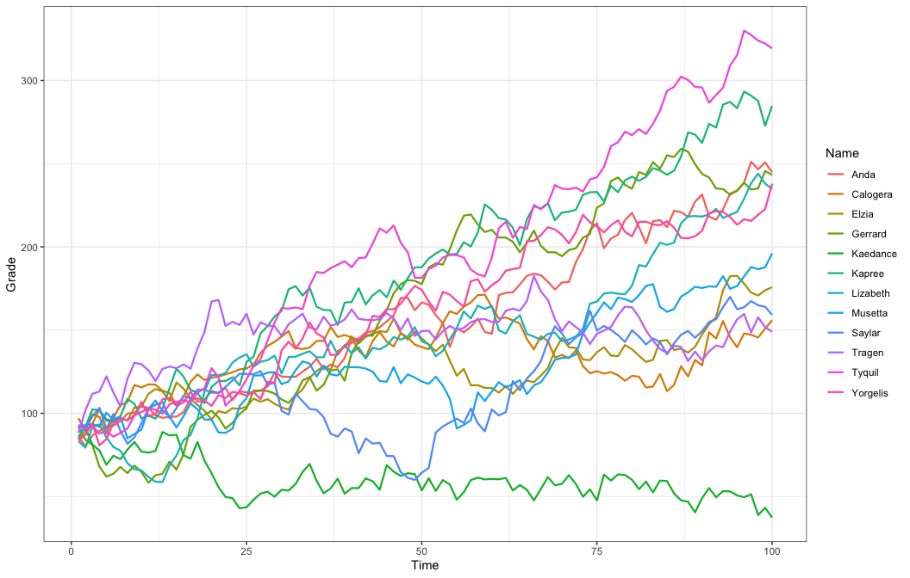
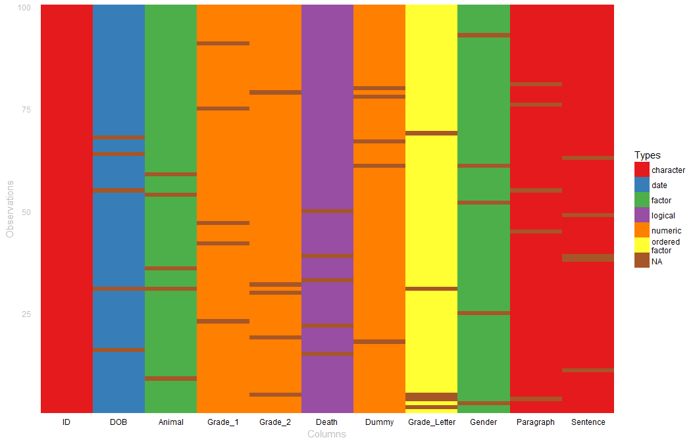

wakefield   
============

**wakefield** is designed to quickly generate random data sets. The user
passes `n` (number of rows) and predefined vectors to the `r_data_frame`
function to produce a `dplyr::tbl_df` object.

Table of Contents
============

-   [Installation](#installation)
-   [Contact](#contact)
-   [Demonstration](#demonstration)
    -   [Getting Started](#getting-started)
    -   [Random Missing Observations](#random-missing-observations)
    -   [Repeated Measures & Time Series](#repeated-measures-time-series)
        -   [Related Series](#related-series)
            -   [Some Examples With Variation](#some-examples-with-variation)
            -   [Adjust Correlations](#adjust-correlations)
            -   [Visualize the Relationship](#visualize-the-relationship)
    -   [Expanded Dummy Coding](#expanded-dummy-coding)
    -   [Visualizing Column Types](#visualizing-column-types)

Installation
============

To download the development version of **wakefield**:

Download the [zip
ball](https://github.com/trinker/wakefield/zipball/master) or [tar
ball](https://github.com/trinker/wakefield/tarball/master), decompress
and run `R CMD INSTALL` on it, or use the **pacman** package to install
the development version:

    if (!require("pacman")) install.packages("pacman")
    pacman::p_load_gh("trinker/wakefield")
    pacman::p_load(dplyr, tidyr, ggplot2)

Contact
=======

You are welcome to:    
- submit suggestions and bug-reports at: <https://github.com/trinker/wakefield/issues>    
- send a pull request on: <https://github.com/trinker/wakefield/>    
- compose a friendly e-mail to: <tyler.rinker@gmail.com>    

Demonstration
=============

Getting Started
---------------

The `r_data_frame` function (random data frame) takes `n` (the number of
rows) and any number of variables (columns). These columns are typically
produced from a **wakefield** variable function. Each of these variable
functions has a pre-set behavior that produces a named vector of n
length, allowing the user to lazily pass unnamed functions (optionally,
without call parenthesis). The column name is hidden as a `varname`
attribute. For example here we see the `race` variable function:

    race(n=10)

    ##  [1] White White White White White White White White White White
    ## Levels: White Hispanic Black Asian Bi-Racial Native Other Hawaiian

    attributes(race(n=10))

    ## $levels
    ## [1] "White"     "Hispanic"  "Black"     "Asian"     "Bi-Racial" "Native"   
    ## [7] "Other"     "Hawaiian" 
    ## 
    ## $class
    ## [1] "variable" "factor"  
    ## 
    ## $varname
    ## [1] "Race"

When this variable is used inside of `r_data_frame` the `varname` is
used as a column name. Additionally, the `n` argument is not set within
variable functions but is set once in `r_data_frame`:

    r_data_frame(
        n = 500,
        race
    )

    ## # A tibble: 500 x 1
    ##    Race    
    ##    <fct>   
    ##  1 Hispanic
    ##  2 Asian   
    ##  3 White   
    ##  4 White   
    ##  5 White   
    ##  6 Black   
    ##  7 White   
    ##  8 Hispanic
    ##  9 White   
    ## 10 Hispanic
    ## # ... with 490 more rows

The power of `r_data_frame` is apparent when we use many modular
variable functions:

    r_data_frame(
        n = 500,
        id,
        race,
        age,
        sex,
        hour,
        iq,
        height,
        died
    )

    ## # A tibble: 500 x 8
    ##    ID    Race    Age Sex    Hour           IQ Height Died 
    ##    <chr> <fct> <int> <fct>  <S3: times> <dbl>  <dbl> <lgl>
    ##  1 001   White    50 Male   00:00:00       88     68 TRUE 
    ##  2 002   White    31 Male   00:00:00      118     72 FALSE
    ##  3 003   White    60 Male   00:00:00      109     68 TRUE 
    ##  4 004   White    72 Female 00:00:00      112     68 TRUE 
    ##  5 005   White    81 Male   00:00:00      103     71 TRUE 
    ##  6 006   Black    21 Male   00:00:00       87     72 FALSE
    ##  7 007   White    64 Female 00:00:00      103     71 FALSE
    ##  8 008   White    26 Female 00:00:00       95     65 TRUE 
    ##  9 009   White    41 Male   00:00:00      109     74 FALSE
    ## 10 010   White    64 Male   00:00:00      103     70 TRUE 
    ## # ... with 490 more rows

There are 49 **wakefield** based variable functions to chose from,
spanning **R**'s various data types (see `?variables` for details).

<!-- html table generated in R 3.6.0 by xtable 1.8-2 package -->
<!-- Sat May 19 09:30:53 2018 -->
<table>
<tr>
<td>
age
</td>
<td>
dice
</td>
<td>
hair
</td>
<td>
military
</td>
<td>
sex_inclusive
</td>
</tr>
<tr>
<td>
animal
</td>
<td>
dna
</td>
<td>
height
</td>
<td>
month
</td>
<td>
smokes
</td>
</tr>
<tr>
<td>
answer
</td>
<td>
dob
</td>
<td>
income
</td>
<td>
name
</td>
<td>
speed
</td>
</tr>
<tr>
<td>
area
</td>
<td>
dummy
</td>
<td>
internet_browser
</td>
<td>
normal
</td>
<td>
state
</td>
</tr>
<tr>
<td>
car
</td>
<td>
education
</td>
<td>
iq
</td>
<td>
political
</td>
<td>
string
</td>
</tr>
<tr>
<td>
children
</td>
<td>
employment
</td>
<td>
language
</td>
<td>
race
</td>
<td>
upper
</td>
</tr>
<tr>
<td>
coin
</td>
<td>
eye
</td>
<td>
level
</td>
<td>
religion
</td>
<td>
valid
</td>
</tr>
<tr>
<td>
color
</td>
<td>
grade
</td>
<td>
likert
</td>
<td>
sat
</td>
<td>
year
</td>
</tr>
<tr>
<td>
date_stamp
</td>
<td>
grade_level
</td>
<td>
lorem_ipsum
</td>
<td>
sentence
</td>
<td>
zip_code
</td>
</tr>
<tr>
<td>
death
</td>
<td>
group
</td>
<td>
marital
</td>
<td>
sex
</td>
<td>
</td>
</tr>
</table>

<b><em>Available Variable Functions</em></b>

However, the user may also pass their own vector producing functions or
vectors to `r_data_frame`. Those with an `n` argument can be set by
`r_data_frame`:

    r_data_frame(
        n = 500,
        id,
        Scoring = rnorm,
        Smoker = valid,
        race,
        age,
        sex,
        hour,
        iq,
        height,
        died
    )

    ## # A tibble: 500 x 10
    ##    ID    Scoring Smoker Race       Age Sex    Hour         IQ Height Died 
    ##    <chr>   <dbl> <lgl>  <fct>    <int> <fct>  <S3: tim> <dbl>  <dbl> <lgl>
    ##  1 001    1.78   TRUE   White       70 Female 00:00:00     87     66 FALSE
    ##  2 002    1.38   TRUE   White       41 Female 00:00:00     98     61 TRUE 
    ##  3 003    0.641  FALSE  White       81 Female 00:00:00    104     68 FALSE
    ##  4 004    0.461  FALSE  White       84 Female 00:00:00    109     70 TRUE 
    ##  5 005    0.179  FALSE  White       23 Female 00:00:00    109     70 FALSE
    ##  6 006    0.0787 FALSE  White       32 Female 00:00:00    105     69 TRUE 
    ##  7 007   -1.52   FALSE  White       69 Female 00:00:00    104     71 FALSE
    ##  8 008    1.04   FALSE  White       24 Female 00:00:00    105     74 TRUE 
    ##  9 009   -0.390  FALSE  White       66 Female 00:00:00    103     70 FALSE
    ## 10 010    1.13   FALSE  Hispanic    84 Male   00:00:00     93     68 TRUE 
    ## # ... with 490 more rows

    r_data_frame(
        n = 500,
        id,
        age, age, age,
        grade, grade, grade
    )

    ## # A tibble: 500 x 7
    ##    ID    Age_1 Age_2 Age_3 Grade_1 Grade_2 Grade_3
    ##    <chr> <int> <int> <int>   <dbl>   <dbl>   <dbl>
    ##  1 001      67    47    46    93.7    89.9    83.7
    ##  2 002      19    26    74    91.8    89      93.1
    ##  3 003      56    20    27    86.5    84.2    80.8
    ##  4 004      81    30    71    91.4    90.6    88.8
    ##  5 005      27    64    81    86.9    94.2    89.8
    ##  6 006      44    81    28    94.7    87.4    90.9
    ##  7 007      20    36    70    93.1    93.2    94.1
    ##  8 008      62    73    22    88.1    85.2    87.4
    ##  9 009      24    78    53    88.1    84.6    87.5
    ## 10 010      62    35    26    87.3    83.6    89.8
    ## # ... with 490 more rows

While passing variable functions to `r_data_frame` without call
parenthesis is handy, the user may wish to set arguments. This can be
done through call parenthesis as we do with `data.frame` or
`dplyr::data_frame`:

    r_data_frame(
        n = 500,
        id,
        Scoring = rnorm,
        Smoker = valid,
        `Reading(mins)` = rpois(lambda=20),  
        race,
        age(x = 8:14),
        sex,
        hour,
        iq,
        height(mean=50, sd = 10),
        died
    )

    ## # A tibble: 500 x 11
    ##    ID    Scoring Smoker `Reading(mins)` Race    Age Sex    Hour         IQ
    ##    <chr>   <dbl> <lgl>            <int> <fct> <int> <fct>  <S3: tim> <dbl>
    ##  1 001     0.900 TRUE                16 White    10 Female 00:00:00    103
    ##  2 002    -0.111 FALSE               19 White     9 Male   00:00:00     99
    ##  3 003     0.531 FALSE               16 White    13 Male   00:00:00     94
    ##  4 004    -1.87  FALSE               26 White     8 Female 00:00:00     83
    ##  5 005    -0.539 FALSE               18 White    14 Male   00:00:00    104
    ##  6 006    -0.646 FALSE               19 White    10 Female 00:00:00     97
    ##  7 007     0.326 TRUE                21 White     9 Male   00:00:00    106
    ##  8 008     2.34  FALSE               20 White     9 Female 00:00:00     99
    ##  9 009    -0.156 TRUE                27 White     8 Male   00:30:00    104
    ## 10 010     0.763 TRUE                17 Black    13 Female 00:30:00    108
    ## # ... with 490 more rows, and 2 more variables: Height <dbl>, Died <lgl>

Random Missing Observations
---------------------------

Often data contains missing values. **wakefield** allows the user to add
a proportion of missing values per column/vector via the `r_na` (random
`NA`). This works nicely within a **dplyr**/**magrittr** `%>%` *then*
pipeline:

    r_data_frame(
        n = 30,
        id,
        race,
        age,
        sex,
        hour,
        iq,
        height,
        died,
        Scoring = rnorm,
        Smoker = valid
    ) %>%
        r_na(prob=.4)

    ## # A tibble: 30 x 10
    ##    ID    Race       Age Sex    Hour         IQ Height Died  Scoring Smoker
    ##    <chr> <fct>    <int> <fct>  <S3: tim> <dbl>  <dbl> <lgl>   <dbl> <lgl> 
    ##  1 01    White       81 Male   <NA>         NA     NA NA      0.862 TRUE  
    ##  2 02    White       86 <NA>   00:30:00    109     73 TRUE   -0.274 FALSE 
    ##  3 03    Hispanic    NA Male   03:30:00    111     65 FALSE  NA     TRUE  
    ##  4 04    White       48 <NA>   03:30:00     NA     72 NA      0.692 TRUE  
    ##  5 05    White       78 <NA>   03:30:00     NA     NA TRUE   NA     FALSE 
    ##  6 06    White       80 Male   05:00:00     NA     66 NA     -0.494 TRUE  
    ##  7 07    <NA>        NA Male   <NA>         NA     67 NA      0.861 FALSE 
    ##  8 08    <NA>        NA Male   <NA>         88     70 TRUE   -1.76  TRUE  
    ##  9 09    <NA>        NA Female 07:30:00     82     NA FALSE  NA     NA    
    ## 10 10    <NA>        59 <NA>   10:00:00     90     63 TRUE    1.30  TRUE  
    ## # ... with 20 more rows

Repeated Measures & Time Series
-------------------------------

The `r_series` function allows the user to pass a single **wakefield**
function and dictate how many columns (`j`) to produce.

    set.seed(10)

    r_series(likert, j = 3, n=10)

    ## # A tibble: 10 x 3
    ##    Likert_1       Likert_2          Likert_3         
    ##  * <ord>          <ord>             <ord>            
    ##  1 Neutral        Disagree          Strongly Disagree
    ##  2 Agree          Neutral           Disagree         
    ##  3 Neutral        Strongly Agree    Disagree         
    ##  4 Disagree       Neutral           Agree            
    ##  5 Strongly Agree Agree             Neutral          
    ##  6 Agree          Neutral           Disagree         
    ##  7 Agree          Strongly Agree    Strongly Disagree
    ##  8 Agree          Agree             Agree            
    ##  9 Disagree       Agree             Disagree         
    ## 10 Neutral        Strongly Disagree Agree

Often the user wants a numeric score for Likert type columns and similar
variables. For series with multiple factors the `as_integer` converts
all columns to integer values. Additionally, we may want to specify
column name prefixes. This can be accomplished via the variable
function's `name` argument. Both of these features are demonstrated
here.

    set.seed(10)

    as_integer(r_series(likert, j = 5, n=10, name = "Item"))

    ## # A tibble: 10 x 5
    ##    Item_1 Item_2 Item_3 Item_4 Item_5
    ##  *  <int>  <int>  <int>  <int>  <int>
    ##  1      3      2      1      3      4
    ##  2      4      3      2      5      4
    ##  3      3      5      2      5      5
    ##  4      2      3      4      1      2
    ##  5      5      4      3      3      4
    ##  6      4      3      2      2      5
    ##  7      4      5      1      1      5
    ##  8      4      4      4      1      3
    ##  9      2      4      2      2      5
    ## 10      3      1      4      3      1

`r_series` can be used within a `r_data_frame` as well.

    set.seed(10)

    r_data_frame(n=100,
        id,
        age,
        sex,
        r_series(likert, 3, name = "Question")
    )

    ## # A tibble: 100 x 6
    ##    ID      Age Sex    Question_1        Question_2        Question_3      
    ##  * <chr> <int> <fct>  <ord>             <ord>             <ord>           
    ##  1 001      54 Male   Agree             Agree             Strongly Disagr~
    ##  2 002      40 Male   Neutral           Strongly Agree    Disagree        
    ##  3 003      48 Male   Disagree          Neutral           Disagree        
    ##  4 004      67 Male   Strongly Disagree Neutral           Disagree        
    ##  5 005      24 Female Strongly Agree    Strongly Disagree Strongly Disagr~
    ##  6 006      34 Female Disagree          Disagree          Agree           
    ##  7 007      37 Female Disagree          Strongly Agree    Strongly Disagr~
    ##  8 008      37 Male   Strongly Disagree Agree             Agree           
    ##  9 009      62 Female Agree             Strongly Agree    Strongly Agree  
    ## 10 010      48 Male   Strongly Disagree Strongly Disagree Agree           
    ## # ... with 90 more rows

    set.seed(10)

    r_data_frame(n=100,
        id,
        age,
        sex,
        r_series(likert, 5, name = "Item", integer = TRUE)
    )

    ## # A tibble: 100 x 8
    ##    ID      Age Sex    Item_1 Item_2 Item_3 Item_4 Item_5
    ##  * <chr> <int> <fct>   <int>  <int>  <int>  <int>  <int>
    ##  1 001      54 Male        4      4      1      1      1
    ##  2 002      40 Male        3      5      2      1      2
    ##  3 003      48 Male        2      3      2      1      2
    ##  4 004      67 Male        1      3      2      4      3
    ##  5 005      24 Female      5      1      1      5      4
    ##  6 006      34 Female      2      2      4      3      4
    ##  7 007      37 Female      2      5      1      5      2
    ##  8 008      37 Male        1      4      4      5      5
    ##  9 009      62 Female      4      5      5      4      3
    ## 10 010      48 Male        1      1      4      1      2
    ## # ... with 90 more rows

### Related Series

The user can also create related series via the `relate` argument in
`r_series`. It allows the user to specify the relationship between
columns. `relate` may be a named list of or a short hand string of the
form of `"fM_sd"` where:

-   `f` is one of (+, -, \*, /)
-   `M` is a mean value
-   `sd` is a standard deviation of the mean value

For example you may use `relate = "*4_1"`. If `relate = NULL` no
relationship is generated between columns. I will use the short hand
string form here.

#### Some Examples With Variation

    r_series(grade, j = 5, n = 100, relate = "+1_6")

    ## # A tibble: 100 x 5
    ##    Grade_1 Grade_2 Grade_3 Grade_4 Grade_5
    ##  *   <dbl>   <dbl>   <dbl>   <dbl>   <dbl>
    ##  1    84.5    92.5    91.6    87.4    76.7
    ##  2    93.1    85      81.8    87.8    91.3
    ##  3    81.6    67.5    52.6    48.8    56.8
    ##  4    92.5    89.3    95.3   102.     94.5
    ##  5    96.6    95.9    98.7   116.    115. 
    ##  6    89.7    88.1    88.8    89.     86.4
    ##  7    92.8    91.7    98.3    98.7   102. 
    ##  8    92.1    92.9    92.6    85.5    93.1
    ##  9    90.6    96.9   104.    108.    106. 
    ## 10    96      94.8    84.3    91.1   107. 
    ## # ... with 90 more rows

    r_series(age, 5, 100, relate = "+5_0")

    ## # A tibble: 100 x 5
    ##    Age_1 Age_2 Age_3 Age_4 Age_5
    ##  * <dbl> <dbl> <dbl> <dbl> <dbl>
    ##  1    37    42    47    52    57
    ##  2    37    42    47    52    57
    ##  3    51    56    61    66    71
    ##  4    29    34    39    44    49
    ##  5    72    77    82    87    92
    ##  6    50    55    60    65    70
    ##  7    23    28    33    38    43
    ##  8    59    64    69    74    79
    ##  9    85    90    95   100   105
    ## 10    77    82    87    92    97
    ## # ... with 90 more rows

    r_series(likert, 5,  100, name ="Item", relate = "-.5_.1")

    ## # A tibble: 100 x 5
    ##    Item_1 Item_2 Item_3 Item_4 Item_5
    ##  *  <dbl>  <dbl>  <dbl>  <dbl>  <dbl>
    ##  1      2      1      0     -1     -1
    ##  2      3      2      1      1      0
    ##  3      1      1      1      0      0
    ##  4      4      3      3      2      1
    ##  5      2      1      1      0      0
    ##  6      2      1      1      1      0
    ##  7      1      0      0     -1     -2
    ##  8      2      2      1      1      0
    ##  9      2      2      1      0      0
    ## 10      3      3      3      3      3
    ## # ... with 90 more rows

    r_series(grade, j = 5, n = 100, relate = "*1.05_.1")

    ## # A tibble: 100 x 5
    ##    Grade_1 Grade_2 Grade_3 Grade_4 Grade_5
    ##  *   <dbl>   <dbl>   <dbl>   <dbl>   <dbl>
    ##  1    85.7    94.3   113.    113.    113. 
    ##  2    86.4    77.8    77.8    85.5    85.5
    ##  3    90.6    99.7    89.7    98.7   109. 
    ##  4    89.1    89.1    89.1    71.3    71.3
    ##  5    87      95.7   115.    103.    114. 
    ##  6    93.9   103.    124.    136.    136. 
    ##  7    80.1    72.1    64.9    84.3    84.3
    ##  8    91.7   110.    132.    132.    145. 
    ##  9    87.4    96.1    96.1   106.    116. 
    ## 10    92.9    92.9    83.6    92.0   101. 
    ## # ... with 90 more rows

#### Adjust Correlations

Use the `sd` command to adjust correlations.

    round(cor(r_series(grade, 8, 10, relate = "+1_2")), 2)

    ##         Grade_1 Grade_2 Grade_3 Grade_4 Grade_5 Grade_6 Grade_7 Grade_8
    ## Grade_1    1.00    0.85    0.64    0.39    0.28    0.25    0.28    0.15
    ## Grade_2    0.85    1.00    0.86    0.68    0.61    0.56    0.56    0.47
    ## Grade_3    0.64    0.86    1.00    0.77    0.70    0.80    0.86    0.78
    ## Grade_4    0.39    0.68    0.77    1.00    0.94    0.80    0.65    0.74
    ## Grade_5    0.28    0.61    0.70    0.94    1.00    0.85    0.69    0.73
    ## Grade_6    0.25    0.56    0.80    0.80    0.85    1.00    0.92    0.89
    ## Grade_7    0.28    0.56    0.86    0.65    0.69    0.92    1.00    0.91
    ## Grade_8    0.15    0.47    0.78    0.74    0.73    0.89    0.91    1.00

    round(cor(r_series(grade, 8, 10, relate = "+1_0")), 2)

    ##         Grade_1 Grade_2 Grade_3 Grade_4 Grade_5 Grade_6 Grade_7 Grade_8
    ## Grade_1       1       1       1       1       1       1       1       1
    ## Grade_2       1       1       1       1       1       1       1       1
    ## Grade_3       1       1       1       1       1       1       1       1
    ## Grade_4       1       1       1       1       1       1       1       1
    ## Grade_5       1       1       1       1       1       1       1       1
    ## Grade_6       1       1       1       1       1       1       1       1
    ## Grade_7       1       1       1       1       1       1       1       1
    ## Grade_8       1       1       1       1       1       1       1       1

    round(cor(r_series(grade, 8, 10, relate = "+1_20")), 2)

    ##         Grade_1 Grade_2 Grade_3 Grade_4 Grade_5 Grade_6 Grade_7 Grade_8
    ## Grade_1    1.00    0.26    0.27    0.40    0.21   -0.21   -0.36   -0.41
    ## Grade_2    0.26    1.00    0.77    0.60    0.64    0.50    0.53    0.46
    ## Grade_3    0.27    0.77    1.00    0.78    0.76    0.66    0.62    0.66
    ## Grade_4    0.40    0.60    0.78    1.00    0.95    0.76    0.59    0.55
    ## Grade_5    0.21    0.64    0.76    0.95    1.00    0.82    0.65    0.61
    ## Grade_6   -0.21    0.50    0.66    0.76    0.82    1.00    0.90    0.82
    ## Grade_7   -0.36    0.53    0.62    0.59    0.65    0.90    1.00    0.94
    ## Grade_8   -0.41    0.46    0.66    0.55    0.61    0.82    0.94    1.00

    round(cor(r_series(grade, 8, 10, relate = "+15_20")), 2)

    ##         Grade_1 Grade_2 Grade_3 Grade_4 Grade_5 Grade_6 Grade_7 Grade_8
    ## Grade_1    1.00   -0.10   -0.50   -0.39   -0.25   -0.52   -0.26   -0.31
    ## Grade_2   -0.10    1.00    0.74    0.50    0.13    0.03    0.36    0.46
    ## Grade_3   -0.50    0.74    1.00    0.81    0.48    0.41    0.71    0.78
    ## Grade_4   -0.39    0.50    0.81    1.00    0.75    0.66    0.58    0.75
    ## Grade_5   -0.25    0.13    0.48    0.75    1.00    0.91    0.70    0.74
    ## Grade_6   -0.52    0.03    0.41    0.66    0.91    1.00    0.58    0.57
    ## Grade_7   -0.26    0.36    0.71    0.58    0.70    0.58    1.00    0.78
    ## Grade_8   -0.31    0.46    0.78    0.75    0.74    0.57    0.78    1.00

#### Visualize the Relationship

    dat <- r_data_frame(12,
        name,
        r_series(grade, 100, relate = "+1_6")
    ) 

    dat %>%
        gather(Time, Grade, -c(Name)) %>%
        mutate(Time = as.numeric(gsub("\\D", "", Time))) %>%
        ggplot(aes(x = Time, y = Grade, color = Name, group = Name)) +
            geom_line(size=.8) + 
            theme_bw()

Expanded Dummy Coding
---------------------

The user may wish to expand a `factor` into `j` dummy coded columns. The
`r_dummy` function expands a factor into `j` columns and works similar
to the `r_series` function. The user may wish to use the original factor
name as the prefix to the `j` columns. Setting `prefix = TRUE` within
`r_dummy` accomplishes this.

    set.seed(10)
    r_data_frame(n=100,
        id,
        age,
        r_dummy(sex, prefix = TRUE),
        r_dummy(political)
    )

    ## # A tibble: 100 x 9
    ##    ID      Age Sex_Male Sex_Female Democrat Republican Constitution
    ##  * <chr> <int>    <int>      <int>    <int>      <int>        <int>
    ##  1 001      54        1          0        1          0            0
    ##  2 002      40        1          0        1          0            0
    ##  3 003      48        1          0        0          1            0
    ##  4 004      67        1          0        0          1            0
    ##  5 005      24        0          1        1          0            0
    ##  6 006      34        0          1        0          1            0
    ##  7 007      37        0          1        0          1            0
    ##  8 008      37        1          0        0          0            0
    ##  9 009      62        0          1        1          0            0
    ## 10 010      48        1          0        0          1            0
    ## # ... with 90 more rows, and 2 more variables: Libertarian <int>,
    ## #   Green <int>

Visualizing Column Types
------------------------

It is helpful to see the column types and `NA`s as a visualization. The
`table_heat` (also the `plot` method assigned to `tbl_df` as well) can
provide visual glimpse of data types and missing cells.

    set.seed(10)

    r_data_frame(n=100,
        id,
        dob,
        animal,
        grade, grade,
        death,
        dummy,
        grade_letter,
        gender,
        paragraph,
        sentence
    ) %>%
       r_na() %>%
       plot(palette = "Set1")

