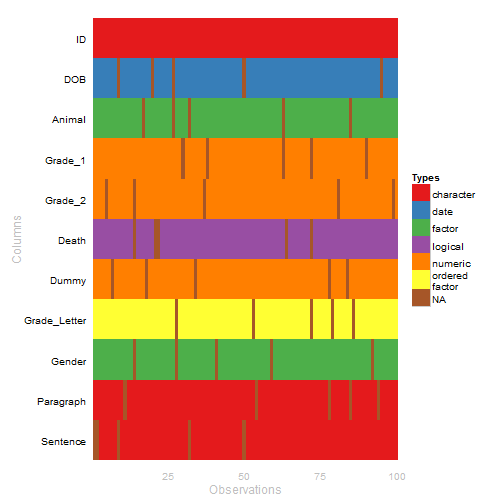

# wakefield


[](http://www.repostatus.org/#wip)
[](https://travis-ci.org/trinker/wakefield)
[](https://coveralls.io/r/trinker/wakefield?branch=master)
[](http://dx.doi.org/10.5281/zenodo.17172)
<a href="https://img.shields.io/badge/Version-0.1.0-orange.svg"></a></p>

**wakefield** is designed to quickly generate random data sets.  The user passes `n` (number of rows) and predefined vectors to the `r_data_frame` function to produce a `dplyr::tbl_df` object.

  

## Installation

To download the development version of **wakefield**:

Download the [zip ball](https://github.com/trinker/wakefield/zipball/master) or [tar ball](https://github.com/trinker/wakefield/tarball/master), decompress and run `R CMD INSTALL` on it, or use the **pacman** package to install the development version:

```r
if (!require("pacman")) install.packages("pacman")
pacman::p_load_gh("trinker/wakefield")
```

## Help
    
- [Package PDF Help Manual](https://dl.dropboxusercontent.com/u/61803503/wakefield.pdf)   


## Contact

You are welcome to:
* submit suggestions and bug-reports at: <https://github.com/trinker/wakefield/issues>
* send a pull request on: <https://github.com/trinker/wakefield/>
* compose a friendly e-mail to: <tyler.rinker@gmail.com>

## Demonstration

The `r_data_frame` function (random data frame) takes `n` (the number of rows) and any number of variables (columns).  These columns are typically produced from a **wakefield** variable function.  Each of these variable functions has a pre-set behavior that produces a named vector of n length, allowing the user to lazily pass unnamed functions (optionally, without call parenthesis).  The column name is hidden as a `varname` attribute.  For example here we see the `race` variable function:


```r
race(n=10)
```

```
##  [1] White    White    Black    White    White    White    White   
##  [8] White    Hispanic Black   
## Levels: White Hispanic Black Asian Bi-Racial Native Other Hawaiian
```

```r
attributes(race(n=10))
```

```
## $levels
## [1] "White"     "Hispanic"  "Black"     "Asian"     "Bi-Racial" "Native"   
## [7] "Other"     "Hawaiian" 
## 
## $class
## [1] "variable" "factor"  
## 
## $varname
## [1] "Race"
```

When this variable is used inside of `r_data_frame` the `varname` is used as a column name.  Additionally, the `n` argument is not set within variable functions but is set once in `r_data_frame`:


```r
r_data_frame(
    n = 500,
    race
)
```

```
## Source: local data frame [500 x 1]
## 
##     Race
## 1  White
## 2  White
## 3  White
## 4  White
## 5  White
## 6  Asian
## 7  White
## 8  Black
## 9  White
## 10 White
## ..   ...
```

The power of `r_data_frame` is apparent when we use many modular variable functions:


```r
r_data_frame(
    n = 500,
    id,
    race,
    age,
    sex,
    hour,
    iq,
    height,
    died
)
```

```
## Source: local data frame [500 x 8]
## 
##     ID  Race Age    Sex     Hour  IQ Height  Died
## 1  001 Black  25   Male 00:00:00 108     65  TRUE
## 2  002 White  33   Male 00:00:00  96     71  TRUE
## 3  003 Black  32 Female 00:00:00  90     70 FALSE
## 4  004 White  24   Male 00:00:00  74     68 FALSE
## 5  005 White  33 Female 00:00:00 104     70  TRUE
## 6  006 White  25   Male 00:00:00 107     66  TRUE
## 7  007 White  35   Male 00:00:00 104     73 FALSE
## 8  008 White  20 Female 00:00:00 107     71  TRUE
## 9  009 Black  27 Female 00:30:00  99     65  TRUE
## 10 010 White  20   Male 00:30:00 107     74  TRUE
## .. ...   ... ...    ...      ... ...    ...   ...
```


There are 68 **wakefield** based variable functions to chose from, spanning **R**'s various data types (see `?variables` for details).  

<!-- html table generated in R 3.2.0 by xtable 1.7-4 package -->
<!-- Thu Apr 30 18:02:29 2015 -->
<table >
  <tr> <td> age </td> <td> died </td> <td> grade_level </td> <td> likert_5 </td> <td> paragraph </td> <td> speed_mph </td> </tr>
  <tr> <td> animal </td> <td> dna </td> <td> group </td> <td> likert_7 </td> <td> pet </td> <td> state </td> </tr>
  <tr> <td> answer </td> <td> dob </td> <td> hair </td> <td> lorem_ipsum </td> <td> political </td> <td> string </td> </tr>
  <tr> <td> area </td> <td> dummy </td> <td> height </td> <td> lower </td> <td> primary </td> <td> upper </td> </tr>
  <tr> <td> birth </td> <td> education </td> <td> height_cm </td> <td> lower_factor </td> <td> race </td> <td> upper_factor </td> </tr>
  <tr> <td> car </td> <td> ela </td> <td> height_in </td> <td> marital </td> <td> religion </td> <td> valid </td> </tr>
  <tr> <td> children </td> <td> employment </td> <td> income </td> <td> math </td> <td> sat </td> <td> year </td> </tr>
  <tr> <td> coin </td> <td> eye </td> <td> internet_browser </td> <td> military </td> <td> sentence </td> <td> zip_code </td> </tr>
  <tr> <td> color </td> <td> gender </td> <td> iq </td> <td> month </td> <td> sex </td> <td>  </td> </tr>
  <tr> <td> date_stamp </td> <td> gpa </td> <td> language </td> <td> name </td> <td> smokes </td> <td>  </td> </tr>
  <tr> <td> death </td> <td> grade </td> <td> level </td> <td> normal </td> <td> speed </td> <td>  </td> </tr>
  <tr> <td> dice </td> <td> grade_letter </td> <td> likert </td> <td> normal_round </td> <td> speed_kph </td> <td>  </td> </tr>
   </table>
<p class="caption"><b><em>Available Variable Functions</em></b></p>

However, the user may also pass their own vector producing functions or vectors to `r_data_frame`.  Those with an `n` argument can be set by `r_data_table`:


```r
r_data_frame(
    n = 500,
    id,
    Scoring = rnorm,
    Smoker = valid,
    race,
    age,
    sex,
    hour,
    iq,
    height,
    died
)
```

```
## Source: local data frame [500 x 10]
## 
##     ID    Scoring Smoker     Race Age    Sex     Hour  IQ Height  Died
## 1  001 -1.5617128   TRUE    White  21   Male 00:00:00 100     77  TRUE
## 2  002  2.4086482  FALSE    White  24 Female 00:00:00 114     71  TRUE
## 3  003  1.2807312   TRUE Hispanic  31 Female 00:00:00 110     68  TRUE
## 4  004 -0.6890110   TRUE    Black  33   Male 00:00:00  97     62  TRUE
## 5  005 -0.3491101   TRUE    White  32 Female 00:00:00 107     67  TRUE
## 6  006 -0.1432578  FALSE    White  26   Male 00:00:00 112     65  TRUE
## 7  007 -0.8839696  FALSE    White  33 Female 00:00:00  90     64  TRUE
## 8  008 -0.4020511  FALSE Hispanic  24 Female 00:00:00  96     75 FALSE
## 9  009 -0.3741693   TRUE    White  34 Female 00:30:00  97     64  TRUE
## 10 010  0.6644089   TRUE    Black  28 Female 00:30:00  88     63  TRUE
## .. ...        ...    ...      ... ...    ...      ... ...    ...   ...
```


```r
r_data_frame(
    n = 500,
    id,
    age, age, age,
    grade, grade, grade
)
```

```
## Source: local data frame [500 x 7]
## 
##     ID Age_1 Age_2 Age_3 Grade_1 Grade_2 Grade_3
## 1  001    31    21    22    87.6    86.7    78.5
## 2  002    32    21    33    86.9    81.4    91.3
## 3  003    35    29    28    84.3    91.1    80.2
## 4  004    20    24    26    93.2    93.0    92.3
## 5  005    27    27    31    84.2    94.2    87.9
## 6  006    23    32    21    99.3    81.0    80.5
## 7  007    31    28    31    85.7    89.3    92.2
## 8  008    30    25    22    87.3    87.0    92.8
## 9  009    21    35    31    89.1    88.6    88.3
## 10 010    30    33    23    92.6    92.5    82.3
## .. ...   ...   ...   ...     ...     ...     ...
```


While, passing variable functions to `r_data_frame` without call parenthesis is handy the user may wish to set arguments.  This can be done through call parenthesis as we do with `data.frame` or `dplyr::data_frame`:


```r
r_data_frame(
    n = 500,
    id,
    Scoring = rnorm,
    Smoker = valid,
    `Reading(mins)` = rpois(lambda=20),  
    race,
    age(x = 8:14),
    sex,
    hour,
    iq,
    height(mean=50, sd = 10),
    died
)
```

```
## Source: local data frame [500 x 11]
## 
##     ID     Scoring Smoker Reading(mins)     Race Age    Sex     Hour  IQ
## 1  001  0.10702766  FALSE            18    White  10   Male 00:00:00 107
## 2  002  0.08998353   TRUE            18    White  14   Male 00:00:00  85
## 3  003  1.08405396   TRUE            18    White  13   Male 00:00:00 116
## 4  004  0.99488395  FALSE            26    White  11   Male 00:00:00 109
## 5  005  0.83049210  FALSE             9 Hispanic  11   Male 00:00:00  94
## 6  006 -0.76249951   TRUE            13    White  10 Female 00:00:00  90
## 7  007  0.06096533  FALSE            26 Hispanic  11   Male 00:00:00 108
## 8  008  0.04183716   TRUE            23    White  10 Female 00:00:00  94
## 9  009  1.90573678   TRUE            22 Hispanic  13   Male 00:00:00 115
## 10 010  0.56571829  FALSE            19 Hispanic  10   Male 00:00:00 102
## .. ...         ...    ...           ...      ... ...    ...      ... ...
## Variables not shown: Height (dbl), Died (lgl)
```

## Random Missing Observations

Often data contains missing values.  **wakefield** allows the user to add a proportion of missing values per column/vector via the `r_na` (random `NA`).  This works nicely within a **dplyr**/**magrittr** `%>%` *then* pipeline:


```r
r_data_frame(
    n = 30,
    id,
    race,
    age,
    sex,
    hour,
    iq,
    height,
    died,
    Scoring = rnorm,
    Smoker = valid
) %>%
    r_na(prob=.4)
```

```
## Source: local data frame [30 x 10]
## 
##    ID     Race Age    Sex     Hour  IQ Height  Died    Scoring Smoker
## 1  01       NA  NA   Male 00:00:00 101     72 FALSE -0.7081720     NA
## 2  02 Hispanic  NA     NA 00:30:00 105     78 FALSE  0.8599923  FALSE
## 3  03    White  27 Female 01:00:00  NA     NA FALSE         NA     NA
## 4  04 Hispanic  20   Male 01:00:00  88     73 FALSE         NA  FALSE
## 5  05    Black  NA     NA 01:30:00  86     68 FALSE         NA  FALSE
## 6  06    White  21   Male     <NA>  NA     NA    NA  0.9155031     NA
## 7  07 Hispanic  20 Female     <NA>  NA     67  TRUE         NA     NA
## 8  08 Hispanic  32     NA 04:30:00  99     70    NA -0.5460636   TRUE
## 9  09       NA  24   Male     <NA> 106     73    NA -0.9711661     NA
## 10 10       NA  NA     NA 07:00:00  90     67    NA  0.6309114   TRUE
## .. ..      ... ...    ...      ... ...    ...   ...        ...    ...
```

## Repeated Measures & Time Series

The `r_series` function allows the user to pass a single **wakefield** function and dictate how many columns (`j`) to produce.  


```r
set.seed(10)

r_series(likert, j = 3, n=10)
```

```
## Source: local data frame [10 x 3]
## 
##           Likert_1          Likert_2          Likert_3
## 1          Neutral          Disagree Strongly Disagree
## 2            Agree           Neutral          Disagree
## 3          Neutral   Strongly Agree           Disagree
## 4         Disagree           Neutral             Agree
## 5  Strongly Agree              Agree           Neutral
## 6            Agree           Neutral          Disagree
## 7            Agree   Strongly Agree  Strongly Disagree
## 8            Agree             Agree             Agree
## 9         Disagree             Agree          Disagree
## 10         Neutral Strongly Disagree             Agree
```

Often the user wants a numeric score for Likert type columns and similar variables.  For series with multiple factors the `as_integer` converts all columns to integer values.  Additionally, we may want to specify column name prefixes. This can be accomplished via the variable function's `name` argument.  Both of these features are demonstrated here.


```r
set.seed(10)

as_integer(r_series(likert, j = 5, n=10, name = "Item"))
```

```
## Source: local data frame [10 x 5]
## 
##    Item_1 Item_2 Item_3 Item_4 Item_5
## 1       3      2      1      3      4
## 2       4      3      2      5      4
## 3       3      5      2      5      5
## 4       2      3      4      1      2
## 5       5      4      3      3      4
## 6       4      3      2      2      5
## 7       4      5      1      1      5
## 8       4      4      4      1      3
## 9       2      4      2      2      5
## 10      3      1      4      3      1
```

`r_series` can be used within a `r_data_frame` as well.  


```r
set.seed(10)

r_data_frame(n=100,
    id,
    age,
    sex,
    r_series(likert, 3, name = "Question")
)
```

```
## Source: local data frame [100 x 6]
## 
##     ID Age    Sex        Question_1        Question_2        Question_3
## 1  001  28   Male             Agree             Agree Strongly Disagree
## 2  002  24   Male           Neutral   Strongly Agree           Disagree
## 3  003  26   Male          Disagree           Neutral          Disagree
## 4  004  31   Male Strongly Disagree           Neutral          Disagree
## 5  005  21 Female   Strongly Agree  Strongly Disagree Strongly Disagree
## 6  006  23 Female          Disagree          Disagree             Agree
## 7  007  24 Female          Disagree   Strongly Agree  Strongly Disagree
## 8  008  24   Male Strongly Disagree             Agree             Agree
## 9  009  29 Female             Agree   Strongly Agree    Strongly Agree 
## 10 010  26   Male Strongly Disagree Strongly Disagree             Agree
## .. ... ...    ...               ...               ...               ...
```


```r
set.seed(10)

r_data_frame(n=100,
    id,
    age,
    sex,
    r_series(likert, 5, name = "Item", integer = TRUE)
)
```

```
## Source: local data frame [100 x 8]
## 
##     ID Age    Sex Item_1 Item_2 Item_3 Item_4 Item_5
## 1  001  28   Male      4      4      1      1      1
## 2  002  24   Male      3      5      2      1      2
## 3  003  26   Male      2      3      2      1      2
## 4  004  31   Male      1      3      2      4      3
## 5  005  21 Female      5      1      1      5      4
## 6  006  23 Female      2      2      4      3      4
## 7  007  24 Female      2      5      1      5      2
## 8  008  24   Male      1      4      4      5      5
## 9  009  29 Female      4      5      5      4      3
## 10 010  26   Male      1      1      4      1      2
## .. ... ...    ...    ...    ...    ...    ...    ...
```

## Expanded Dummy Coding

The user may wish to expand a `factor` into `j` dummy coded columns.  The `r_dummy` function expands a factor into `j` columns and works similar to the `r_series` function.  The user may wish to use the original factor name as the prefix to the `j` columns.  Setting `prefix = TRUE` within `r_dummy` accomplishes this.


```r
set.seed(10)
r_data_frame(n=100,
    id,
    age,
    r_dummy(sex, prefix = TRUE),
    r_dummy(political)
)
```

```
## Source: local data frame [100 x 9]
## 
##     ID Age Sex_Male Sex_Female Constitution Democrat Green Libertarian
## 1  001  28        1          0            1        0     0           0
## 2  002  24        1          0            1        0     0           0
## 3  003  26        1          0            0        1     0           0
## 4  004  31        1          0            0        1     0           0
## 5  005  21        0          1            1        0     0           0
## 6  006  23        0          1            0        1     0           0
## 7  007  24        0          1            0        1     0           0
## 8  008  24        1          0            0        0     0           0
## 9  009  29        0          1            1        0     0           0
## 10 010  26        1          0            0        1     0           0
## .. ... ...      ...        ...          ...      ...   ...         ...
## Variables not shown: Republican (int)
```


## Visualizing Column Types

It is helpful to see the column types and `NA`s as a visualization.  The `table_heat` (the `plot` method assigned to `tbl_df` as well).


```r
set.seed(10)

r_data_frame(n=100,
    id,
    dob,
    animal,
    grade, grade,
    death,
    dummy,
    grade_letter,
    gender,
    paragraph,
    sentence
) %>%
   r_na() %>%
   plot(palette = "Set1")
```

 


